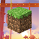

<a id="readme-top"></a>

<!-- PROJECT SHIELDS -->
<!--
*** https://www.markdownguide.org/basic-syntax/#reference-style-links
-->
[![Contributors][contributors-shield]][contributors-url]
[![Forks][forks-shield]][forks-url]
[![Stargazers][stars-shield]][stars-url]
[![Issues][issues-shield]][issues-url]
[![License][license-shield]][license-url]

<!-- PROJECT LOGO -->
<br />
<div align="center">
  <a href="https://github.com/gafda/example-repo">
    
  </a>

  <h3 align="center">MineNostalgia Server Website</h3>

  <p align="center">
    A Website for my minecraft server. Frontend, backend and mongoDb database running on Docker Containers.
  </p>
</div>

<!-- TABLE OF CONTENTS -->
<details>
  <summary>Table of Contents</summary>
  <ol>
    <li>
      <a href="#about-the-project">About The Project</a>
      <ul>
        <li><a href="#built-with">Built With</a></li>
      </ul>
    </li>
    <li>
      <a href="#getting-started">Getting Started</a>
      <ul>
        <li><a href="#prerequisites">Prerequisites</a></li>
        <li><a href="#installation">Installation</a></li>
      </ul>
    </li>
    <li><a href="#usage">Usage</a></li>
    <li><a href="#roadmap">Roadmap</a></li>
    <li><a href="#contributing">Contributing</a></li>
    <li><a href="#license">License</a></li>
    <li><a href="#contact">Contact</a></li>
    <li><a href="#acknowledgments">Acknowledgments</a></li>
  </ol>
</details>

<!-- ABOUT THE PROJECT -->
## About The Project

[![Product Name Screen Shot, may be ani-gif][product-screenshot]]()

This project is designed to provide a simple solution for showing player statistics on a Minecraft server through a website. It aims to create an easy-to-use platform where players can see their stats and achievements. A custom plugin collects data from the server and saves it in a MongoDB database. By displaying this information on the website, the project helps keep players engaged and builds a competitive community.

<p align="right">(<a href="#readme-top">back to top</a>)</p>

### Built With

This section lists the major frameworks and libraries used to bootstrap the project. Additional add-ons or plugins will be mentioned in the acknowledgements section. Here are the main technologies utilized:

[![Docker][docker-shield]][docker-url]
[![React][react-shield]][react-url]
[![MongoDB][mongodb-shield]][mongodb-url]
[![Node.js][nodejs-shield]][nodejs-url]

<p align="right">(<a href="#readme-top">back to top</a>)</p>

<!-- GETTING STARTED -->
## Getting Started

This is an example of how you may give instructions on setting up your project locally.
To get a local copy up and running follow these simple example steps.

### Prerequisites

Software:
* Docker

### Installation

1. Clone the repo
    ```sh
    git clone https://github.com/AfonsoBatista7/minenostalgia-server-website
    cd minenostalgia-server-website
    ```

2. Create a .env file
    ```sh
    cd .\.docker
    touch .env
    ```

3. Edit .env file
    - Use your favorite text editor to write on the .env file
        ```txt
        #Mongo Populator
        MONGO_INITDB_ROOT_USERNAME=<username>
        MONGO_INITDB_ROOT_PASSWORD=<password>
        MONGO_HOST=mongodb           
        MONGO_PORT=27017
        DUMP_DIR="./dump"

        #Grafana Auth
        GF_SECURITY_ADMIN_USER=<username>
        GF_SECURITY_ADMIN_PASSWORD=<password>
        #Backend
        MINECRAFT_SERVER_IP=mn.mobren.net
        ```
    - Save it.

5. Go to scripts folder and chose the operating system you're using
    ```sh
    cd .\scripts\docker\
    ```
    if **windows**
    ```sh
    cd windows
    ```
    if **linux**
    ```sh
    cd linux
    ```

6. Start Docker
    Using your operating system search engine search for Docker and open it.

7. Run the Project 
    ```sh
    .\up.bat
    ```
9. Open your browser and navigate to `http://localhost:80`
10. Enjoy!

<p align="right">(<a href="#readme-top">back to top</a>)</p>

<!-- CONTRIBUTING -->
## Contributing

Contributions are what make the open source community such an amazing place to learn, inspire, and create. Any contributions you make are **greatly appreciated**.

If you have a suggestion that would make this better, please fork the repo and create a pull request. You can also simply open an issue with the tag "enhancement".
Don't forget to give the project a star! Thanks again!

1. Fork the Project
2. Create your Task Branch (`git checkout -b task-my-awesome-task`)
3. Commit your Changes (`git commit -m 'Add some thing that you did.'`)
4. Push to the Branch (`git push origin task-my-awesome-task`)
5. Open a Pull Request from `task-my-awesome-task` to `dev` branch.
    a. Please include a summary of the changes you made.
    b. Include screenshots or gifs if applicable.
    c. Include relevant links to issues or documentation.
    d. Assign to yourself
    e. Request a review from the project maintainer(s)

**NOTES:**

- Please use the following naming convention for branches:

a. (task) - for tasks: `git checkout -b task-my-awesome-task`
b. (feature) - for new features: `git checkout -b feature-my-amazing-feature`
c. (bug) - for bug fixes: `git checkout -b fix-my-awesome-fix`

### Top contributors:

<a href="https://github.com/AfonsoBatista7/minenostalgia-server-website/graphs/contributors">
  
</a>

<p align="right">(<a href="#readme-top">back to top</a>)</p>

<!-- LICENSE -->
## License

Distributed under the GPL-3 License. See `LICENSE.txt` for more information.

<p align="right">(<a href="#readme-top">back to top</a>)</p>

<!-- CONTACT -->
## Contact

Email - [afonsobatista13@gmail.com](mailto://afonsobatista13@gmail.com)

Project Link: [https://github.com/AfonsoBatista7/minenostalgia-server-website](https://github.com/AfonsoBatista7/minenostalgia-server-website)

<p align="right">(<a href="#readme-top">back to top</a>)</p>

<!-- MARKDOWN LINKS & IMAGES -->
<!-- https://www.markdownguide.org/basic-syntax/#reference-style-links -->
<!-- From own repo -->
[contributors-shield]: https://img.shields.io/github/contributors/gafda/example-repo.svg?style=for-the-badge
[contributors-url]: https://github.com/gafda/example-repo/graphs/contributors
[forks-shield]: https://img.shields.io/github/forks/gafda/example-repo.svg?style=for-the-badge
[forks-url]: https://github.com/gafda/example-repo/network/members
[issues-shield]: https://img.shields.io/github/issues/gafda/example-repo.svg?style=for-the-badge
[issues-url]: https://github.com/gafda/example-repo/issues
[license-shield]: https://img.shields.io/github/license/gafda/example-repo.svg?style=for-the-badge
[license-url]: https://github.com/gafda/example-repo/blob/master/LICENSE.txt
[stars-shield]: https://img.shields.io/github/stars/gafda/example-repo.svg?style=for-the-badge
[stars-url]: https://github.com/gafda/example-repo/stargazers
<!-- From repo images -->
[product-screenshot]: ./docs/images/product.png
<!-- From badges -->
[nodejs-shield]: https://img.shields.io/badge/NodeJs-18.16.0-blue?style=for-the-badge&logo=nodejs&logoColor=white
[nodejs-url]: https://nodejs.org/en
[docker-shield]: https://img.shields.io/badge/Docker-24.0+-2496ED?style=for-the-badge&logo=docker&logoColor=white
[docker-url]: https://www.docker.com
[mongodb-shield]: https://img.shields.io/badge/MongoDB-8.8.1-blueviolet?style=for-the-badge&logo=mongodb&logoColor=white
[mongodb-url]: https://www.mongodb.com/
[react-shield]: https://img.shields.io/badge/React-18.3.1+-326CE5?style=for-the-badge&logo=react&logoColor=white
[react-url]: https://react.dev
